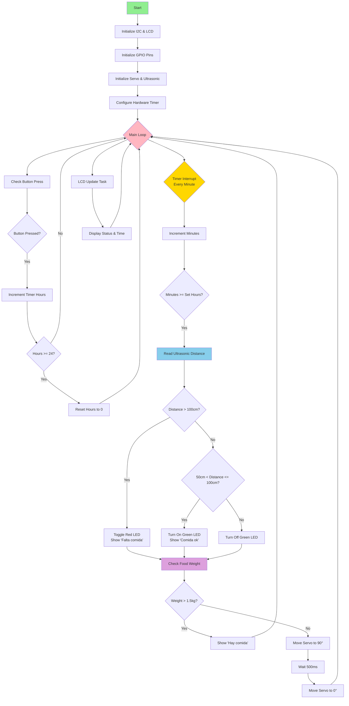
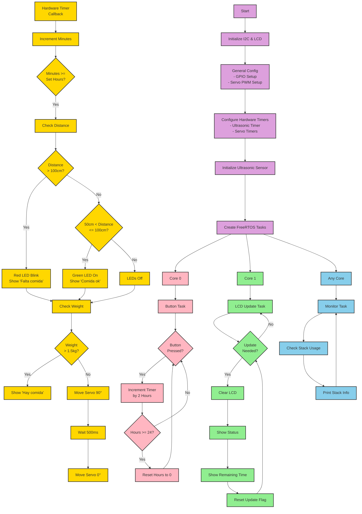

## Codigo para el esp32

## bibliografía

### Servo 
https://www.youtube.com/watch?v=jJQG936B6uM 

### Hx-711 ( celda de carga )  
https://github.com/akshayvernekar/HX711_IDF/tree/master

## Diagrama de flujo

### Segunda interación del código

